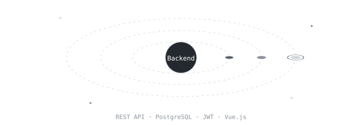
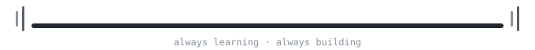

<h1>Anjar Wicaksono</h1>

<em>Software Engineering student building reliable backend &amp; web applications.</em>

---

## About Me

Saya bernama **Anjar Wicaksono**, siswa jurusan **Rekayasa Perangkat Lunak (RPL)** di **SMK Bahrul Ulum Surabaya**, dengan fokus pada *backend development* dan *web development*.

Ketertarikan utama saya ada di belakang layar — bagaimana data mengalir dari database, diproses di server, dan sampai ke pengguna dengan aman dan efisien.

**Fokus pengembangan:**

- Membangun **REST API** dan logika aplikasi
- Merancang **skema database relasional**
- **Autentikasi & otorisasi** berbasis JWT
- Integrasi **layanan eksternal** (payment gateway — Midtrans sandbox)
- Arsitektur **frontend–backend** yang terpisah dengan rapi

Cara belajar saya: *build, break, investigate, fix.* Bangun sistem, temukan masalah, telusuri akar masalahnya, lalu selesaikan dengan solusi yang tepat.

---

## Tech Stack

**Bahasa pemrograman**

**Frontend**

**Backend**

**Database**

**Tools &amp; Workflow**

---

## Projects

| Project | Description | Tech Stack |
|---|---|---|
| **GearFlow** | Sistem peminjaman alat sekolah — manajemen stok alat, peminjaman, dan pengembalian. |   |
| **EJT** — East Java Traveling | Platform traveling Jawa Timur: pencarian destinasi, *virtual currency*, integrasi payment **Midtrans (sandbox)**. |     |
| **Ovena** | Website toko kue modern ala e-commerce — katalog produk, keranjang, alur transaksi. |   |
| **Bombskuy!** | Game Bomberman — kontrol **WASD**, murni client-side. |    |

---

## Competition

| Event | Result | Deliverable | Date |
|---|---|---|---|
| **LKS Webtech** — Tingkat Surabaya | **Juara 2** | Sistem Informasi dengan Laravel + Vue Vite | Feb 2026 |
| **LKS Webtech** — Tingkat Jawa Timur | Peserta | Game (HTML/CSS/JS) & aplikasi dengan Laravel + Vue Vite | Apr 2026 |
| **JYCC** — Jatim Youth Codepreneur Challenge | Peserta | Aplikasi web traveling EJT | Nov 2025 |

---

## Contact

Terbuka untuk kesempatan **Praktik Kerja Lapangan (PKL)** dan kolaborasi — jangan ragu untuk menghubungi.

 <a href="https://github.com/Zerc61">github.com/Zerc61</a> 
 <a href="mailto:sampbernad@gmail.com">sampbernad@gmail.com</a> 
 <a href="https://wa.me/6282336082154">0823-3608-2154</a>

